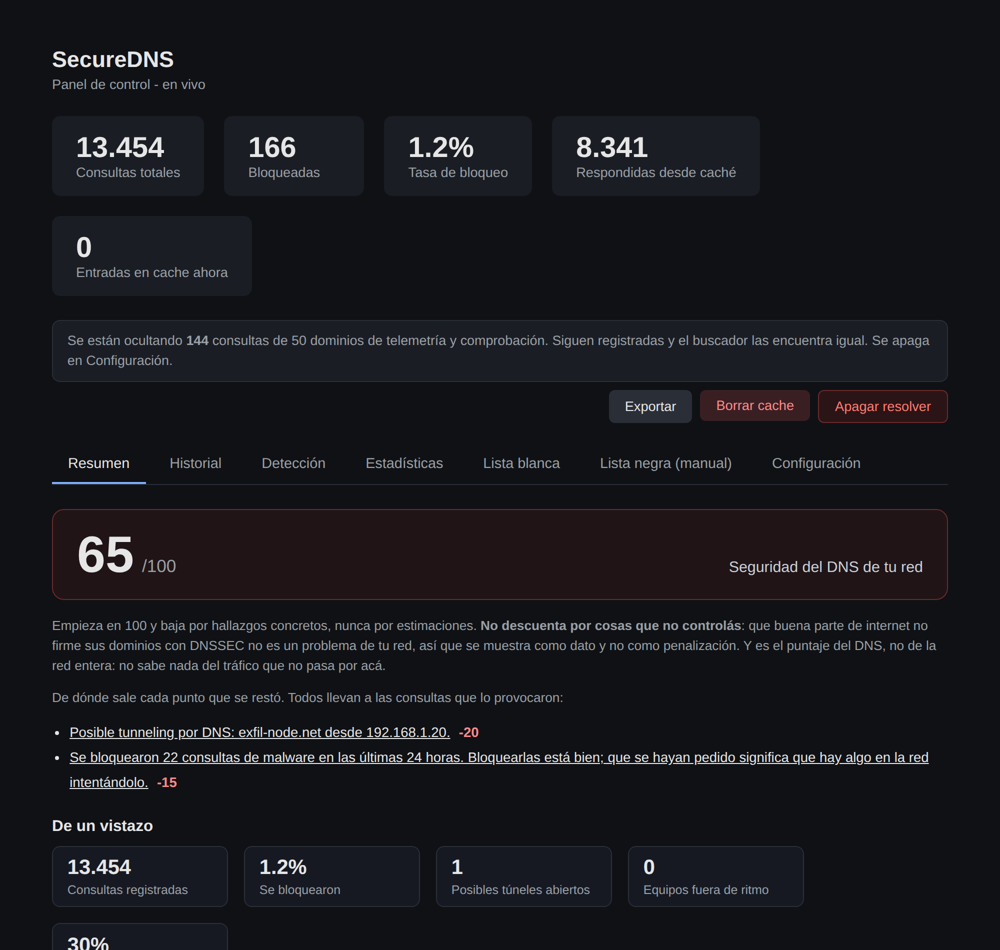
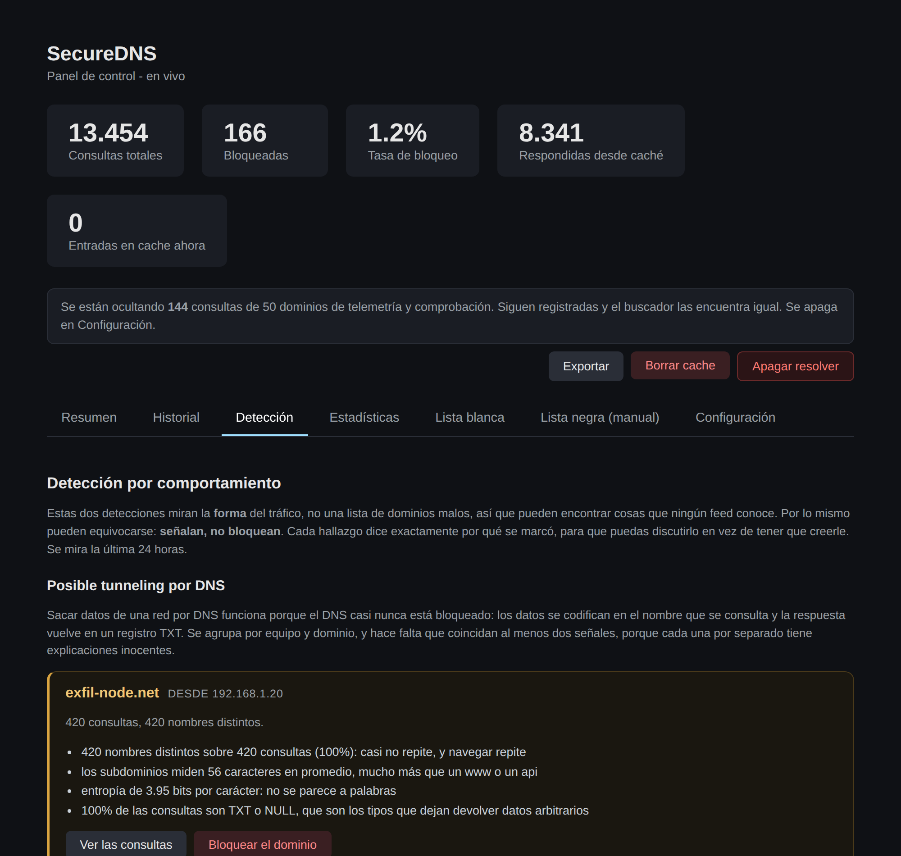
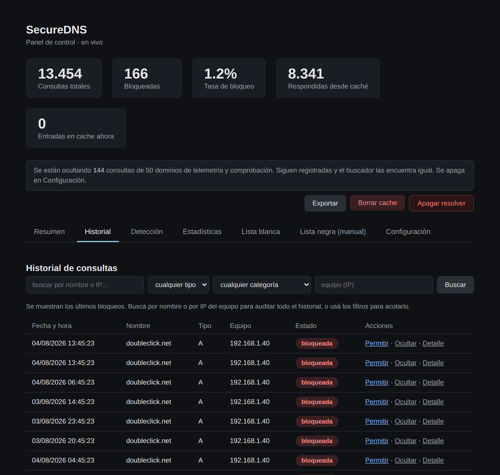
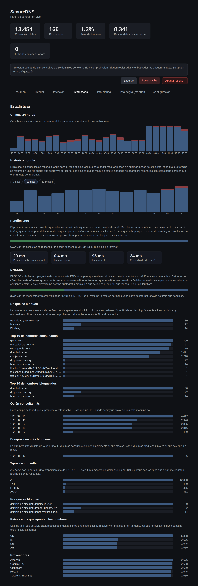
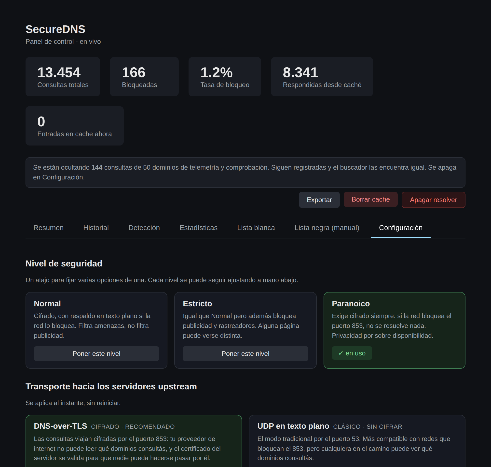

# SecureDNS


Resolver DNS local con filtrado de dominios maliciosos conocidos. Es una
capa de un stack personal de seguridad en profundidad ("defense in depth")
junto con [SecureProxy](https://github.com/matiaselebi/secure-proxy) (filtrado
de tráfico de aplicaciones) y [SecureVPN](https://github.com/matiaselebi/secure-vpn)
(transporte cifrado): mientras el proxy filtra el tráfico de las
aplicaciones que lo tienen configurado, este DNS filtra a nivel de
resolución de nombres, cubriendo también aplicaciones que no respetan la
configuración de proxy del sistema. Los tres se encienden y se miran juntos
desde [SecureCenter](https://github.com/matiaselebi/secure-center). Ver "Qué NO hace" más abajo para los límites explícitos de
alcance de este proyecto en particular.

## Qué hace

- Escucha consultas DNS en `127.0.0.1`, por **UDP y por TCP**. Lo de TCP no es
  un extra: cuando una respuesta no entra en un datagrama vuelve truncada y el
  cliente reintenta por TCP, así que sin eso esas consultas no se resuelven
  nunca.
- Antes de resolver, chequea el nombre contra la **lista blanca** (gana sobre
  todo lo demás) y después contra la lista negra: la manual más la generada
  desde URLhaus y OpenPhish. Si está bloqueado responde al instante, sin salir
  a internet, con **NXDOMAIN, `0.0.0.0` o `127.0.0.1`** según cómo lo
  configures.
- Lo que no está bloqueado se reenvía a **Quad9** (`9.9.9.9`), que además
  filtra malware por su cuenta, con **Cloudflare** (`1.1.1.1`) de respaldo.
- Esa charla va **cifrada con DNS-over-TLS** por defecto: tu proveedor de
  internet ya no puede leer qué dominios consultás. Implementado solo con la
  librería estándar (`ssl` + `socket`): cero dependencias nuevas y cero
  criptografía propia.
- **Detecta tunneling por DNS y equipos que se salen de su ritmo**, mirando la
  forma del tráfico y no una lista. Es lo único que solo un resolver puede ver,
  y señala sin bloquear.
- Cachea las respuestas respetando su TTL, con techo por arriba y por abajo, y
  **valida que la respuesta sea realmente la de la consulta** antes de
  guardarla.
- Registra todo en SQLite y lo muestra en un panel web con siete pestañas:
  puntaje de seguridad, historial con buscador y filtros, detección,
  estadísticas, las dos listas y configuración. Se actualiza solo sin recargar,
  exporta a CSV y JSON, y expone una **API de solo lectura** para SecureCenter.

## Qué NO hace (alcance del proyecto)

Este proyecto está limitado a resolución recursiva/forwarding con filtrado
de amenazas para una sola máquina. Explícitamente fuera de alcance, y por
qué:

- **No sirve DNS para toda una red local** (no es para el router de tu
  casa): eso requeriría que la máquina esté siempre encendida y accesible
  desde otros dispositivos, un caso de uso distinto al de este proyecto.
- **No administra un dominio público** (zonas, registros TXT de
  verificación, SPF/DKIM/DMARC): estas funciones son para quien es dueño y
  administra el DNS de un dominio real, un problema distinto al de filtrar
  las consultas salientes de una PC.
- **No implementa mDNS** (descubrimiento de dispositivos tipo Chromecast):
  es un protocolo distinto (multicast, puerto 5353), no una extensión de un
  resolver DNS convencional.
- **No hace geolocalización ni balanceo de carga geográfico**: esas son
  funciones que implementan los *proveedores* de contenido (Netflix,
  Cloudflare), no algo que un resolver casero necesite construir.

## Estructura del proyecto

```
secure-dns/
├── README.md
├── requirements.txt
├── .env.example            # plantilla de secretos (el .env real no se sube)
├── .gitignore
├── LICENSE
├── config/
│   └── config.yaml
├── data/
│   ├── blocklist.txt       # lista negra manual
│   ├── allowlist.txt       # lista blanca (gana sobre la negra)
│   └── noisy_domains.txt   # telemetría que el panel oculta (no cambia el filtrado)
├── src/securedns/
│   ├── __init__.py
│   ├── config_loader.py    # lee el YAML sin morirse por una sección vacía
│   ├── config_writer.py    # escribe config.yaml sin perder los comentarios
│   ├── validation.py       # limpia y normaliza nombres, de entrada y de comparación
│   ├── blocklist.py        # Blocklist + Allowlist, con categorías por feed
│   ├── view_prefs.py       # qué se MUESTRA (filtro de ruido), separado de qué se BLOQUEA
│   ├── net_config.py       # devuelve el DNS del sistema a automático al apagar
│   ├── logger_db.py        # historial, agregaciones y resúmenes diarios
│   ├── deteccion.py        # tunneling y actividad anómala (código puro, sin base)
│   ├── puntaje.py          # el score, cada punto trazable a un hallazgo
│   ├── geoip.py            # país/ASN de la IP que devolvió la respuesta (base local)
│   ├── rdap.py             # edad del dominio (opt-in, cacheada, fail-open)
│   ├── alertas.py          # avisos por umbral, no por cada bloqueo
│   ├── notifier.py         # canal Telegram
│   ├── desktop_alerts.py   # canal notificación de escritorio
│   ├── dns_server.py       # el resolver: filtrado, caché, DoT/UDP, TCP
│   └── dashboard.py        # panel web + API (8890)
├── scripts/
│   ├── run_dns.py
│   ├── stop_dns.py         # detiene y restaura el DNS del sistema
│   ├── update_blocklist.py
│   └── update_geoip.py     # arma la base local de país/ASN
├── SecureDNS.bat           # panel de control para Windows
├── tests/                  # 16 archivos, 256 tests
├── docs/
│   ├── adr/                # 5 decisiones de diseño documentadas
│   ├── img/                # capturas del panel
│   └── PLAN.md             # las cinco fases y lo que quedó afuera, con motivos
├── docker/
│   └── Dockerfile
└── .github/                # CI + Dependabot
```

## Instalación

### Windows

```powershell
git clone https://github.com/matiaselebi/secure-dns.git
cd secure-dns
python -m venv venv
venv\Scripts\activate
pip install -r requirements.txt
```

### Linux / macOS

```bash
git clone https://github.com/matiaselebi/secure-dns.git
cd secure-dns
python3 -m venv venv
source venv/bin/activate
pip install -r requirements.txt
```

## Uso

En primer plano:

```bash
python scripts/run_dns.py
```

En Windows, la forma más simple es `SecureDNS.bat`, que ofrece un panel con
8 opciones:

1. **Iniciar DNS**: registra el inicio automático con Windows, arranca el
   resolver de inmediato, y configura `127.0.0.1` como servidor DNS en todos
   los adaptadores de red activos (equivalente a hacerlo a mano desde
   Configuración → Red e Internet → DNS, pero automático).
2. **Detener DNS**: quita el inicio automático, vuelve el DNS de los
   adaptadores a automático (DHCP), y detiene el proceso.
3. **Ver estado**: si el inicio automático está activo, si el proceso está
   corriendo, qué DNS tiene configurado cada adaptador en este momento, y
   cuántas entradas tiene el cache ahora (solo si el resolver está
   corriendo, porque ese cache vive en memoria, sin persistencia en disco).
4. **Actualizar listas de amenazas**: fuerza la descarga de URLhaus y
   OpenPhish. El resolver también lo hace solo, en segundo plano, respetando
   un intervalo mínimo configurable (6 horas por defecto).
5. **Agregar dominio a la lista blanca**: pide el dominio por teclado y lo
   agrega a `data/allowlist.txt`. Si el resolver está corriendo, se aplica
   solo en unos segundos (recarga automática cada 15 segundos), sin
   necesidad de reiniciar el proceso.
6. **Agregar dominio a la lista negra**: igual que la anterior, pero a
   `data/blocklist.txt` (la lista manual).
7. **Borrar cache de respuestas DNS**: si el resolver está corriendo, lo
   vacía al instante (llama al mismo endpoint que el botón del dashboard).
   Si no está corriendo, no hay nada que borrar (el cache es en memoria).
8. **Salir**.

Requiere permisos de administrador (se auto-eleva pidiéndolos si hace
falta), porque cambiar el DNS de un adaptador de red y registrar tareas
programadas necesita ese nivel de acceso en Windows.

### El panel

Con el resolver corriendo, `http://127.0.0.1:8890/` muestra cinco tarjetas
arriba (consultas totales, bloqueadas, tasa de bloqueo, respondidas desde
caché y entradas en el cache ahora mismo), tres botones a la derecha
(**Exportar**, **Borrar cache** y **Apagar resolver**), y siete pestañas.



#### Resumen: el puntaje

Es lo primero que se ve. Un número del 0 al 100 con el estado del DNS de la
red, y debajo la lista de todo lo que lo bajó.

Un puntaje es lo más fácil de hacer mal de todo el proyecto: un número grande
que tranquiliza sin motivo es peor que no tener número. Las tres reglas que lo
hacen defendible, todas puestas como tests en `tests/test_fase5.py`:

1. **Cada punto sale de un hallazgo concreto.** No hay componentes de ambiente
   ni ponderaciones inventadas. Si bajó, hay algo específico que lo bajó.
2. **Cada descuento es un link.** Al lado de "posible tunneling desde
   192.168.1.20" hay un link que te lleva a esas consultas. Un puntaje que no
   se puede auditar es un adorno.
3. **No se descuenta por cosas que no controlás.** El caso claro es DNSSEC: que
   media internet no firme sus dominios no es un problema de tu red, así que se
   muestra como dato y no como penalización.

Empieza en 100 y resta, para que el estado "no encontré nada" se entienda solo.
Cada categoría tiene un techo: diez hallazgos de tunneling no pueden restar
200, porque el puntaje se clavaría en cero y dejaría de distinguir un problema
de un desastre.

Y es el puntaje **del DNS**, no de la red. Un 100 acá no dice nada del tráfico
que no pasa por acá. El de la red entera es de SecureCenter, que ve las tres
capas.

#### Detección: lo que solo un resolver puede ver



**Tunneling por DNS.** Sacar datos de una red codificándolos en el nombre que
se consulta y recibiendo la respuesta en un registro TXT. Funciona porque el
DNS casi nunca está bloqueado, y es lo que usan varias familias de malware para
exfiltrar datos y para hablar con su servidor de control. El proxy ve una
conexión a un puerto y la VPN ve un túnel cifrado: el único que ve los nombres,
uno por uno, es el DNS.

Primero se descarta por volumen: menos de 40 consultas contra el mismo padre no
es evidencia de nada, porque cualquier navegación genera un puñado de nombres.
Lo que queda se mide con cuatro señales: cuántos nombres distintos hay sobre el
total, cuánto miden los subdominios, su entropía, y qué proporción de consultas
son TXT o NULL.

**Hacen falta al menos dos señales coincidentes**, porque cada una sola tiene
explicaciones inocentes: un CDN genera montones de subdominios distintos, un
hash tiene entropía alta, DMARC usa TXT. Con una sola el panel se llena de
ruido y se ignora; con tres se escapan los túneles lentos. La mitad de los
tests de esa fase son casos que **no** se tienen que marcar.

**Actividad fuera de lo normal.** Un equipo que multiplica su ritmo habitual de
consultas. Cada uno se compara **contra sí mismo** y no contra los demás: una
tele consulta muchísimo menos que una notebook, así que un umbral igual para
todos marcaría siempre a la misma máquina. Se usa la mediana de las horas
anteriores, porque con el promedio un pico previo esconde el siguiente.

Las dos **señalan, no bloquean** (ver [ADR 0004](docs/adr/0004-deteccion-por-comportamiento.md)),
y cada hallazgo muestra los números que lo provocaron, para que se pueda
discutir en vez de tener que creerle.

**Marcar un hallazgo como normal.** Un detector que mira la forma del tráfico
va a marcar alguna vez algo esperable, y el caso de manual es un CDN de video:
`googlevideo.com` genera un nombre distinto por servidor y por sesión, largo y
sin forma de palabra, o sea dos señales de las cuatro. El detector no está
fallando: describe bien un tráfico que casualmente tiene la misma forma que un
túnel. Lo que falta es que alguien lo mire una vez y diga "esto es YouTube".
Cada hallazgo tiene un botón **"Es normal, no marcarlo más"** que lo cierra:
deja de aparecer y deja de restar puntaje.

Tres cosas lo hacen honesto:

- **No es una lista blanca.** El dominio se sigue filtrando igual que
  cualquier otro (si mañana entra a un feed de amenazas, se bloquea), se sigue
  registrando, y sus consultas se ven enteras en el historial. Lo único que se
  silencia es el aviso. Hay un test que lo verifica, porque es justamente el
  error que convertiría un botón de triage en un agujero.
- **Se ve lo que silenciaste.** Al pie de la pestaña queda la lista de lo
  marcado, con un botón para volver a vigilarlo. Un panel que esconde hallazgos
  sin decir cuáles termina en verde por acumulación de decisiones que nadie
  recuerda haber tomado.
- **No viene nada marcado de fábrica.** Sería más fácil traer una lista de CDNs
  conocidos y saltearlos, y sería peor: un atacante que sepa que esa lista
  existe tunelea bajo un nombre que esté en ella, y el ruido de cada red es
  distinto igual. La decisión la toma quien mira el panel, que es el único que
  sabe qué hay en su red.

#### Historial



Todas las consultas, no solo los bloqueos, con la fecha en **hora local**, el
tipo de registro, qué equipo la hizo y acciones para permitir, bloquear u
ocultar. Cada fila se despliega en un detalle con todo lo que se sabe: de dónde
salió la respuesta, cuánto tardó, a qué IP resolvió, de qué país y proveedor es
esa IP, y si vino validada con DNSSEC.

Arriba hay un buscador con filtros por tipo, categoría y equipo. Los valores de
los desplegables salen de lo que **realmente hay** en la base: ofrecer un
filtro por NULL cuando nunca llegó una consulta NULL es prometer algo que va a
devolver cero. Buscando, el filtro de "solo bloqueadas" y el de ruido se
ignoran a propósito: si estás auditando un equipo querés ver todo.

#### Estadísticas



Consultas por hora de las últimas 24, histórico por día con ventanas de 7 días,
30 días y 12 meses, rendimiento, DNSSEC, de qué se bloqueó, los dos Top 10 de
nombres, quién consulta más, equipos con más bloqueos, tipos de consulta,
motivos de bloqueo, y países y proveedores de destino.

Tres que vale la pena explicar:

**El rendimiento separa el caché de internet.** Promediarlos juntos da un
número que baja cuanto más caché tenés y que no sirve para detectar nada. Lo
que importa es cuánto tarda una consulta que **sí** tiene que salir, porque eso
es lo que se dispara cuando hay un problema con el upstream. Los bloqueos
tampoco entran: responder un bloqueo es instantáneo.

**El histórico sobrevive al recorte.** El historial se poda cuando pasa el tope
de filas, así que mostrar "12 meses" leyendo de ahí sería mentir. Lo que entra
al historial se va sumando a una tabla de resúmenes diarios, y el recorte solo
puede borrar filas que ya estén sumadas. Los días en que la máquina estuvo
apagada no aparecen: rellenarlos con ceros haría parecer que el DNS dejó de
funcionar.

**El DNSSEC dice quién validó.** El porcentaje sale del flag AD que manda el
upstream, o sea que quiere decir "**Quad9** validó la firma", no "la validamos
nosotros". Validar de verdad es implementar la cadena de confianza entera, y
este proyecto no escribe criptografía propia. Poner "dominio firmado ✓" a secas
sería atribuirse trabajo ajeno.

#### Configuración



Arriba, los **tres niveles de seguridad**, que fijan varias opciones de una
sola vez porque la pregunta que uno se hace es "qué tan estricto lo quiero" y
no opción por opción:

- **Normal**: cifrado, con respaldo en texto plano si la red lo bloquea. Filtra
  amenazas, no filtra publicidad.
- **Estricto**: igual, y además bloquea publicidad y rastreadores.
- **Paranoico**: exige cifrado siempre. Si la red bloquea el puerto 853, no se
  resuelve nada.

Si después tocás una opción suelta, el nivel pasa a mostrarse como
**personalizado**: dejar marcado un nivel que ya no es el que está puesto sería
peor que no mostrar ninguno.

Abajo, las seis opciones sueltas, todas escritas en `config/config.yaml` sin
perder los comentarios del archivo:

- **Modo de upstream**: `dot` o `udp`. En caliente.
- **Respaldo en texto plano** si el cifrado falla. En caliente.
- **Con qué se responde un dominio bloqueado**: NXDOMAIN, `0.0.0.0` o
  `127.0.0.1`. En caliente. No es estético: NXDOMAIN es lo más limpio pero
  algunas aplicaciones lo leen como "se cayó la red" y reintentan, mientras que
  `0.0.0.0` falla al instante y suele romper menos cosas. Para tipos que no son
  A ni AAAA siempre se responde NXDOMAIN, porque fabricar un TXT inventado
  sería peor que decir que el nombre no existe.
- **Bloqueo de publicidad y rastreadores**. Necesita reiniciar, y el panel lo
  aclara en vez de fingir que ya está activo.
- **Ocultar telemetría del panel**, con la lista plegada ahí mismo. En caliente.
- **Caché mínimo**. En caliente.

Y un botón para borrar el historial entero.

#### Se actualiza solo, sin recargar

El panel mantiene abierta una conexión de Server-Sent Events y el servidor
manda solo los pedazos que cambiaron. Antes había un `<meta refresh>` de 5
segundos, y el problema no era la frecuencia sino que recargaba la página
entera: reseteaba el scroll y borraba lo que estuvieras escribiendo. Si el
navegador no soporta SSE, o si la conexión falla tres veces seguidas, se cae
solo al refresco clásico en vez de quedar congelado.

El canal recibe los mismos filtros que la página. Sin eso pasaba algo que
parecía un bug del filtro y no lo era: ponías un filtro y cinco segundos
después la primera actualización lo pisaba con el historial sin filtrar.

#### El botón de apagar

Cierra el proceso desde el navegador. Hace lo mismo que Ctrl+C: cierra el
resolver y el panel, borra `data/dns.pid`, **devuelve el DNS del sistema a
automático** y sale con código 0. Contesta antes de morirse, porque al revés el
navegador mostraría un error justo cuando la acción funcionó.

#### Por qué el panel se defiende, si escucha solo en localhost

Que escuche en `127.0.0.1` no lo hace inalcanzable: **cualquier página web que
visites puede hacerle pedidos a tu propia máquina**. Estas tres defensas tapan
agujeros que existían de verdad:

- **CSRF.** Todas las acciones son GET sin token, así que una página cualquiera
  podía hacer `` y
  dejarte las consultas en texto plano, o meter su propio dominio en tu lista
  blanca donde ningún feed lo va a poder frenar. No hace falta leer la respuesta
  para que el daño esté hecho. Las rutas que cambian algo miran
  `Sec-Fetch-Site` y, si no viene, `Origin`/`Referer`.
- **DNS rebinding**, que acá tiene su gracia porque el ataque se monta sobre DNS
  y la víctima es el panel del resolver. Un atacante publica `attacker.com` con
  TTL 0, te hace entrar y después lo reapunta a `127.0.0.1`: desde ahí su
  JavaScript es del mismo origen y puede LEER las respuestas, o sea el historial
  de DNS de toda la casa. La defensa es mirar el header `Host`.
- **XSS en los onclick.** El nombre de una consulta lo elige quien tenga un
  equipo en tu red, o el malware que corre en él. Estaba interpolado adentro del
  `onclick`, y ahí escapar con `html.escape` no alcanza: el navegador decodifica
  las entidades HTML **antes** de que el parser de JavaScript vea el código, así
  que `&#39;` vuelve a ser una comilla, cierra el string y lo que sigue se
  ejecuta. Ahora viaja en un atributo `data-` y se lee con `getAttribute`.

### La API de solo lectura

```
GET /api                 los recursos disponibles
GET /api/estado          lo mínimo para una tarjeta de estado
GET /api/historial       ?q= &limite= &bloqueadas=
GET /api/estadisticas    totales, latencia, DNSSEC, categorías, top
GET /api/detecciones     tunneling y actividad anómala
GET /api/clientes        ?limite=
GET /api/listas          lista negra manual, lista blanca, ocultos
```

Existe por un motivo que no es "queda lindo en el README": hoy las tres
herramientas de la suite no tienen ningún contrato entre ellas, y la
alternativa a una API es que SecureCenter raspe el HTML del panel, que se rompe
con cada cambio de diseño. Si esta forma se porta a SecureProxy y a SecureVPN,
el problema queda resuelto para la suite entera.

Es de **solo lectura**, y eso es lo que permite que no tenga token: si algo
pudiera cambiar la configuración habría que autenticarlo de verdad, y montar un
esquema de tokens en un servicio que escucha en `127.0.0.1` es más superficie
que problema resuelto. Todo lo que cambia algo sigue en el panel, detrás del
chequeo anti-CSRF.

**No manda `Access-Control-Allow-Origin`**, y es deliberado: es lo primero que
uno agrega cuando algo "no anda" desde el navegador, y agregarlo abriría
`/api/historial` a cualquier sitio que visites. Detalle en
[ADR 0005](docs/adr/0005-api-de-solo-lectura.md).

### Avisos

Cuando algo cruza un umbral, por notificación de escritorio y opcionalmente por
Telegram.

**No avisa por cada bloqueo**, y esa es la decisión principal. Un resolver que
atiende a toda la casa con la lista de publicidad activada bloquea miles de
consultas por día: un aviso por bloqueo sería una notificación cada pocos
segundos, o sea una herramienta que terminás apagando. Y apagada no avisa nada.

Avisa por picos comparados con tu propio ritmo, por malware y phishing (que son
pocos y cada uno importa), y por hallazgos nuevos de la pestaña Detección. Con
silencio de una hora por aviso repetido y techo de seis por hora.

El token de Telegram va en `.env`, nunca en el `config.yaml`: un token en el
config es un token en el repositorio, y eso no se deshace con un commit.

### Probarlo sin cambiar la configuración de red

```bash
python -c "
import socket
from dnslib import DNSRecord
q = DNSRecord.question('example.com')
s = socket.socket(socket.AF_INET, socket.SOCK_DGRAM)
s.settimeout(3)
s.sendto(q.pack(), ('127.0.0.1', 53))
print(DNSRecord.parse(s.recvfrom(512)[0]))
"
```

## Apagarlo no te tiene que dejar sin internet

Este era un bug real y molesto, y vale la pena contarlo porque explica una
decisión de diseño.

`SecureDNS.bat` pone `127.0.0.1` como servidor DNS de todos los adaptadores
activos: es lo que hace que tu PC use este resolver. El problema era que el
reset de esa configuración vivía en el `.bat` (opción 2) y el matar el
proceso vivía en `scripts/stop_dns.py`. **Dos caminos, y solo uno
restauraba.** Apagando desde SecureCenter, con Ctrl+C, o con el botón del
panel, el resolver moría y los adaptadores quedaban apuntando a un
`127.0.0.1` donde ya no escuchaba nadie. A partir de ahí ningún nombre
resolvía, y eso se siente exactamente igual que quedarse sin wifi.

El síntoma era tener que abrir PowerShell y pegar esto cada vez:

```powershell
Get-NetAdapter | Where-Object {$_.Status -eq 'Up'} | ForEach-Object {
  Set-DnsClientServerAddress -InterfaceIndex $_.InterfaceIndex -ResetServerAddresses }
ipconfig /flushdns
```

Ahora la restauración vive en **un solo lugar**
(`src/securedns/net_config.py`) y la usan todos los caminos de apagado: el
`finally` del resolver -que cubre Ctrl+C, el botón del panel y cerrar la
sesión-, `stop_dns.py` -que es el que llama SecureCenter- y el `.bat`, que
dejó de tener su propia copia del comando. Hay un test que falla si alguien
vuelve a pegar PowerShell adentro del `.bat`, porque el bug no fue el
comando: fue tenerlo duplicado.

Y es más preciso que el comando de arriba. Ese resetea **todos** los
adaptadores activos, así que si tenés un DNS interno puesto a mano (el del
trabajo, una VPN) te lo borra también. `net_config.py` pregunta primero cuáles
están apuntando a `127.0.0.1` o `::1`, o sea a nosotros, y toca solo esos.
Después vacía el cache de nombres de Windows, porque si no el sistema sigue
contestando desde su propia memoria un rato y parece que el arreglo no
funcionó.

Si falla -que casi siempre es porque falta correr como administrador- lo dice
con todas las letras y deja el comando manual a mano, en la consola y en la
página de despedida del panel. Alguien leyendo ese mensaje está justo sin
poder navegar: no es momento de un "error" pelado.

En Linux y macOS no hace nada, porque ahí el DNS se configura de otra forma
(systemd-resolved, NetworkManager, `/etc/resolv.conf`) y no es este proyecto
el que lo cambia. Tampoco le toca deshacerlo.

## El historial es acumulado

El historial de la pestaña **Historial** es
**acumulado desde la primera vez que corriste el resolver**, no solo desde
el último arranque. Cada consulta (bloqueada, cacheada o resuelta) se
guarda en `data/dns_logs.db` (SQLite), que persiste en disco entre
reinicios, y el dashboard muestra las últimas 50 bloqueadas de esa base
completa (o todo el historial de un nombre o de un equipo, si buscás).

El historial **se recorta solo** cuando pasa el tope de `logging.max_rows`
(200.000 por defecto): se conservan las más recientes, que son las únicas que
el panel muestra. Sin eso, un resolver que atiende a toda la casa llena el
disco sin que nadie lo note, porque cada página web dispara decenas de
consultas.

Si un dominio que esperabas ver bloqueado no aparece, lo más probable es
que la consulta nunca haya llegado a este resolver - por ejemplo, si la
app usa su propio DNS interno (algunos navegadores con "DNS sobre HTTPS"
activado ignoran el DNS del sistema operativo), o si el adaptador de red
que estás usando en ese momento no tiene `127.0.0.1` configurado como su
DNS. Para confirmar, mirá el total de "Consultas totales" del dashboard
mientras reproducís el caso: si no se mueve, la consulta no está pasando
por acá.

## Configuración (`config/config.yaml`)

- `dns.host` / `dns.port`: dirección y puerto donde escucha (default
  `127.0.0.1:53`).
- `dns.upstream_primary` / `dns.upstream_fallback`: servidores DNS a los que
  se reenvía lo que no está bloqueado (default Quad9 + Cloudflare).
- `dns.upstream_mode`: `"dot"` (DNS-over-TLS cifrado, puerto 853, default) o
  `"udp"` (texto plano clásico, puerto 53).
- `dns.upstream_primary_tls_name` / `dns.upstream_fallback_tls_name`: nombre
  que debe figurar en el certificado TLS de cada upstream (solo modo `dot`).
  Si el certificado no coincide, la conexión se rechaza - esto impide que
  alguien en la red se haga pasar por Quad9/Cloudflare.
- `dns.dot_fallback_to_udp`: si ningún upstream respondió por TLS, `true`
  (default) permite caer a UDP plano para no quedarse sin internet; `false`
  responde `SERVFAIL` antes que consultar sin cifrar (privacidad estricta).
- `dns.upstream_timeout`: segundos de espera antes de intentar el respaldo.
- `dns.min_cache_ttl`: TTL mínimo de caché, aunque la respuesta real traiga
  uno menor.
- `filtering.blocklist_path` / `filtering.feeds_blocklist_path`: listas
  manual y automática de dominios bloqueados.
- `filtering.allowlist_path`: lista blanca manual (o vía el botón "Permitir"
  del dashboard). Gana por sobre la blocklist.
- `filtering.feeds_update_interval_hours`: cada cuánto se refresca la lista
  automática al arrancar (default 6 horas).
- `filtering.enable_ad_tracker_blocklist`: `false` por defecto. Si es
  `true`, además de la blocklist de amenazas se descarga y aplica una
  lista de dominios de publicidad/tracking (feed StevenBlack/hosts) como
  categoría separada - ver "Bloqueo opcional de ads/trackers" abajo y
  [ADR 0003](docs/adr/0003-optional-ad-tracker-category.md).
- `filtering.ad_tracker_blocklist_path`: archivo donde se guarda esa lista
  opcional (default `data/blocklist_adtracker.txt`).
- `filtering.block_mode`: con qué se responde un dominio bloqueado.
  `"nxdomain"` (default), `"zero"` (0.0.0.0) o `"localhost"` (127.0.0.1).
- `logging.max_rows`: tope de filas del historial (default 200.000). Se recorta
  solo, y solo borra lo que ya está sumado al resumen diario. `0` = sin límite.
- `dashboard.hide_noise`: si el panel oculta la telemetría (default `true`). Es
  un filtro de VISTA: no cambia nada de lo que se bloquea.
- `dashboard.noisy_domains_path`: la lista de esos dominios.
- `dashboard.normal_findings_path`: los hallazgos de Detección marcados como
  normales (default `data/deteccion_normales.txt`, vacío). Silencia el hallazgo
  y su descuento de puntaje; **no** es una lista blanca y no cambia ninguna
  decisión de bloqueo.
- `intel.rdap_enabled`: consultar por RDAP la edad de un dominio. **Apagado por
  defecto**: cada consulta le cuenta a un tercero qué dominio estás mirando,
  que es justo lo que evita el DoT. Cuando se prende, se consulta solo para los
  hallazgos de Detección, con cache de 30 días y tope de consultas por vuelta.
- `intel.geoip_db_path`: base local de país y ASN. Se descarga una vez con
  `python scripts/update_geoip.py` y después se consulta en disco, sin red.
- `intel.alerts_enabled`: avisos por umbral (default `true`).
- `intel.telegram_enabled`: además por Telegram. El token va en `.env`.
- `intel.rdap_cache_path`: dónde se guarda lo que RDAP ya respondió.
- `logging.db_path`: el archivo de historial (default `data/dns_logs.db`).
- `dashboard.host` / `dashboard.port`: dónde escucha el panel y la API (default
  `127.0.0.1:8890`). Si lo cambiás, acordate de que `SecureDNS.bat` y el
  `docker run` del final apuntan al 8890.

## Bloqueo opcional de ads/trackers

Aparte de la blocklist de amenazas (malware, phishing, C2), se puede activar
una categoría separada de dominios de publicidad/tracking (feed
StevenBlack/hosts) con `filtering.enable_ad_tracker_blocklist: true` en
`config/config.yaml`. Se mantiene en su propio archivo
(`data/blocklist_adtracker.txt`), separado de la blocklist de amenazas, y
desactivada por defecto: bloquear ads no es lo mismo que bloquear amenazas
activas, y algún sitio puede depender visualmente de un tracker para cargar
contenido - por eso es opt-in explícito y no viene mezclado con la lista de
seguridad. Detalle en
[ADR 0003](docs/adr/0003-optional-ad-tracker-category.md).

## Validación de dominios en el dashboard

Los formularios de "Lista blanca" y "Lista negra" **limpian** lo que les
pegues antes de guardarlo (`src/securedns/validation.py`). Nadie copia
dominios sueltos: uno copia la barra del navegador, y de ahí sale
`https://www.ejemplo.com/algo?x=1`. Antes eso se rechazaba en silencio y
había que editarlo a mano, que es justo el momento en que uno se equivoca.
Ahora se le saca el esquema, el camino, el puerto y el `www.`, se guarda
`ejemplo.com`, y el panel avisa qué le sacó: una lista que calladamente
guarda algo distinto de lo que escribiste es una fuente de sorpresas.

Se saca el `www.` porque las listas ya matchean subdominios, así que
guardando el dominio raíz la regla cubre las dos formas; al revés no, guardar
`www.ejemplo.com` dejaría pasar `ejemplo.com`. Si después de limpiar no queda
algo con forma de dominio o IP, no se escribe nada.

Al **mostrar**, en cambio, el `www.` no se saca, y esta es una diferencia
deliberada con SecureProxy. En el proxy lo que se muestra es a qué sitio
fuiste, y `www.ejemplo.com` y `ejemplo.com` son el mismo sitio. En un
resolver son dos **nombres** distintos, que pueden apuntar a IPs distintas:
taparlo haría que dos filas legítimamente diferentes se vean idénticas, que
es lo contrario de lo que uno quiere mirando un log de DNS.

Y hay una normalización que no es cosmética: el nombre consultado se compara
contra las listas sin el punto final del FQDN y pasado a punycode. `nanopool.org.`
y `nanopool.org` son el mismo nombre para el DNS y resuelven igual, pero las
listas comparan texto: con el punto al final no matcheaba nada y la consulta
pasaba limpita. Lo mismo con los nombres internacionales, que se comparaban
en Unicode mientras los feeds los publican en punycode.

## Tests

```bash
pytest tests/ -v
```

**256 tests verdes** (más uno que se saltea solo si la red bloquea el puerto
853), repartidos en 16 archivos.

Lo básico: listas negra y blanca (exacta, subdominios, combinación de
archivos), resolución con allowlist, bloqueo, caché y respaldo de upstream
(contra servidores de prueba locales, sin depender de la red real), validación
de dominios, parseo de los feeds, panel de configuración, y el modo
DNS-over-TLS completo (framing TCP con streams fragmentados y conexiones rotas
a mitad de respuesta, elección de camino, reintento con conexión nueva, y un
test de integración real contra Quad9 que se saltea solo si la red bloquea el
853).

Lo de cada fase:

- **Fase 1**: que la categoría salga del feed y no se invente, que un archivo
  viejo sin marcas siga andando, que los tres modos de bloqueo respondan lo que
  dicen y que para TXT siempre sea NXDOMAIN, que la latencia separe caché de
  internet y excluya bloqueos y timeouts, y que exportar respete el filtro y
  use hora local.
- **Fase 2**: la mitad son **falsos positivos que no se tienen que marcar**: un
  CDN con 300 nombres distintos, hashes largos que se repiten, TXT de DMARC,
  navegación normal, un equipo que recién se prende. Más el túnel de manual que
  sí se marca, que los dominios argentinos no se agrupen todos bajo `com.ar`, y
  que el filtro de ruido no esconda una detección.
- **Fase 3**: que se le pida DNSSEC al upstream (sin eso la estadística daría
  0% para toda internet, que es un número falso y no bajo), que los bloqueos y
  el caché no entren en esa cuenta, que la geolocalización salga de la
  respuesta sin consultas extra, y que RDAP esté apagado por defecto, cachee,
  frene si el servicio se cae y no rompa nada cuando el TLD no publica RDAP.
- **Fase 4**: que la API no mande CORS, que valide el `Host`, que aplique los
  topes de los parámetros y que un recurso inventado devuelva 404 diciendo
  cuáles hay. Que los avisos no salten por publicidad, que no se repitan, que
  un canal caído no frene al otro. Y que el canal en vivo no pise los filtros.
- **Fase 5**: que el puntaje empiece en 100, que cada descuento lleve a las
  consultas que lo provocaron, que **no** descuente por DNSSEC, que los topes
  por categoría eviten que se clave en cero, y que el histórico sobreviva al
  recorte del historial.

Y `tests/test_seguridad.py`, con una regresión por cada agujero que la
auditoría de cierre encontró y que se verificó antes de arreglarlo: respuestas
UDP forjadas con otro ID o de otra pregunta, TTL sin techo, respuestas gigantes
que llenaban la memoria, el caché reventando bajo ocho hilos, un punto final en
una entrada del feed como bypass de un carácter, inyección de líneas por
`/ocultar`, el `Host` con IPv6, y detalles internos filtrados en un error de la
API.

## Docker

```bash
docker build -t secure-dns -f docker/Dockerfile .
docker run -p 127.0.0.1:53:53/udp -p 8890:8890 secure-dns
```

## Decisiones de diseño (ADRs)

Las decisiones que no son obvias están documentadas en `docs/adr/`, con su
contexto y sus consecuencias:

1. [El alcance: una sola máquina](docs/adr/0001-udp-only-single-machine-scope.md):
   por qué esto no es un DNS para toda la red. La parte de "solo UDP" de ese
   ADR quedó revisada: hoy también escucha por TCP, porque sin eso las
   respuestas truncadas no se resuelven nunca.
2. [DoT por defecto con respaldo UDP](docs/adr/0002-dot-default-with-udp-fallback.md):
   por qué se prioriza que internet siga andando, y cómo apagarlo.
3. [La categoría de ads es opcional](docs/adr/0003-optional-ad-tracker-category.md):
   por qué bloquear publicidad no viene mezclado con bloquear malware.
4. [La detección señala, no bloquea](docs/adr/0004-deteccion-por-comportamiento.md):
   por qué hacen falta dos señales, por qué cada hallazgo muestra sus números,
   y por qué un detector estadístico no puede cortar tráfico.
5. [La API es de solo lectura y sin CORS](docs/adr/0005-api-de-solo-lectura.md):
   por qué eso permite no tener token, y qué habría que revisar si algún día
   SecureCenter necesita actuar y no solo mirar.

Y en [`docs/PLAN.md`](docs/PLAN.md) está el plan de las cinco fases con el
apartado de lo que **no** entró y por qué: el timeline tipo SIEM y el riesgo
global de la red porque son de SecureCenter, exportar a PCAP porque habría que
fabricar un archivo que dice ser una captura y no lo es, elegir el upstream más
rápido solo porque Quad9 es primario por lo que filtra y no por lo que tarda, y
la "categoría/reputación" comercial de un dominio porque sin fuente serían
campos inventados.

## Roadmap

- Bloqueo también por IP de destino (usando Feodo Tracker), verificando la IP
  que devuelve el upstream antes de responder al cliente.
- Nombres locales personalizados para dispositivos de tu red (ej. `nas.local` →
  `192.168.1.50`).
- Servicio de systemd, como el que ya tiene SecureProxy, para el servidor de
  casa.
- Que SecureCenter consuma la API y que esta misma forma se porte a SecureProxy
  y a SecureVPN.


## Aviso

Proyecto educativo/de portfolio. Pensado para uso personal en una sola
máquina, no para producción ni para servir DNS a una red de terceros.

## Autor

Matias Elebi - [LinkedIn](https://www.linkedin.com/in/matiaselebi/) · [GitHub](https://github.com/matiaselebi)

## Licencia

MIT
